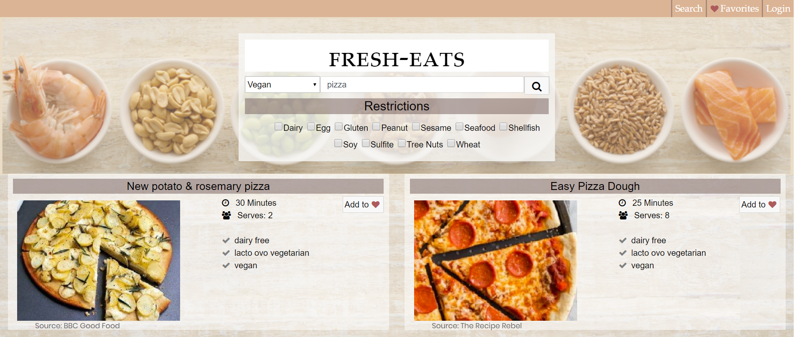

# Memory Game

## Purpose

A recipe search engine that allows you to search for recipes while specifying allergy and diet preferences. You can then login and save recipes to your favorites where you can tag and sort your favorite recipes.

## Instructions

The box to the left of the searchbar is dietary preferences, the checkboxes below are intolerances. Choose your preferences then search for a food item you would ike a recipe for. The recipes will display below, click on the title to go directly to the recipes. You can login on the upper right and make an account on the same page. After taht you can save recipes to favorites, then go to favorites to see your saved recipes.

On the favorites page you can create tags in the text box, after than you can use the dropdown on each recipe card to assign a tag to them, they can have as many tags as you'd like. You can then filter your recipes by using the dropdown on the top. It will only display recipes that have the selected tag.

## Link to Deplloyed Version
https://fresh-eating.herokuapp.com/

## Images

## Author

Evan Jones: https://github.com/EvanJJones

## Technologies Used

MongoDB, Express, React, Node.js

## Contact

evan@evanjjones.com
